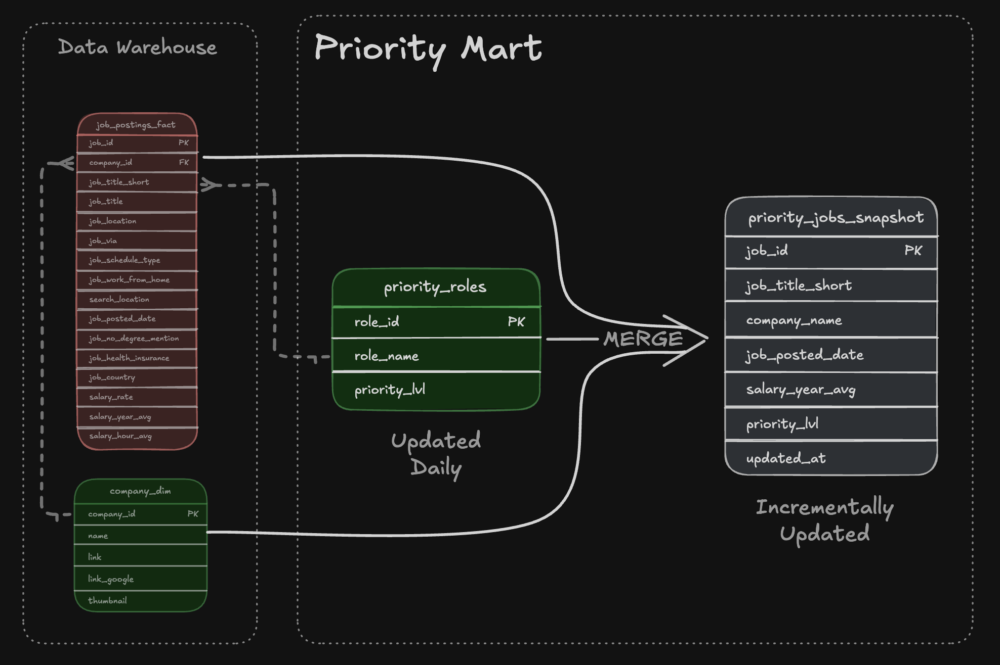

# Data warehouse and Mart build: Production ETL Pipeline

An end-to-end data engineering pipleline that transforms raw CSV files stored in Google cloud storage into a normalized star schema data warehouse, then build data marts for analytics.

## 🧾 Executive Summary (For Hiring Managers)
- **Pipeline scope** Built a complete **ETL pipleline** from raw CSVs to star schema warehouse to analytical marts
- **Data Modeling:** Designed a **star schema** with fact tables, dimensions, and bridge tables for many-to-many relationships
- **ETL Development:** Implemented **extract, transform, load** processes with idempotent operations and ata qualitiy checks
- **Mart Architecture:** Created **specialized marts** (flat, skills and priority) with additive measures and incremental update patterns.

## 🧩 Problem & Context
### Why we need this data warehouse
**Challenge:** Company data teams need a single source of truth system i.e a data warehouse, to enable consistent, reilaable analysis across the organization. Additonally, speciallized data marts are required to optimize resources by pre-aggrgatin data for specific business use cases, reducing query complexity and improving performance for common analytical patterns.

**Solution:** End-to-end ETL pipeline that extracts CSVs from cloud storage, nomalies them into a star schema warehouse (seperating fact from dimension), and creates specialize data marts for specific use cases (flat queries, skill demand analysis and priority role tracking).

## 🛠️ Tech Stack
* 🦆 **Query engine:** DuckDB, chosen for fast, OLAP-style analytical queries without the overhead of a full database server
* 🧮 **Language:** SQL (ANSI-style, leaning on window and aggregate functions for the heavier analysis). DDL for schema design & DML for data loading and transformation
* 📊 **Data model:** Star schema — fact table + dimension tables + a bridge table to handle the many-to-many skill relationship
* 🛠️ **Development:** VS Code for writing and organizing SQL, Terminal for running the DuckDB CLI
* 📦 **Version control:** Git/GitHub, so every query is tracked and the analysis is reproducible
* ☁️ **Storage:** Google Cloud Storage for source CSV files
*  🔧 **Automation:** Master SQL build script for pipeline orchestration

## 🏗️ Pipeline Architecture

The pipeline transforms job postings CSV from Google Cloud storage into a normalized star schema data warehouse, then builds analytical data marts. BI tools like Excel, Power BI, Tableau, Python consume from both marts and warehouse.

## Data Warehouse
The data wareouse implements a star schema using `company_dim`, `skills_dim`,`job_postings_fact` and `skills_job_dim` tables.

- **SQL Files:**  
    -[`01_create_tables_dw.sql`](../2_DW_Mart_Build/01_create_tables_dw.sql) Defines star schema with 4 core tables
    -[`02_load_schema_dw.sql`](../2_DW_Mart_Build/02_load_schema_dw.sql) Extracts CSVs from Google Cloud Storage and loads into warehouse tables
- **Purpose:** Star schema serving as single source of truth for analytical queries
- **Grain:** one row per job posting in the fact table (`job_posting_fact`)

## Flat Mart
A Denormalized table with all dimensions for adhoc queries

- **SQL Files:**  
    -[`3_create_flat_mart.sql`](../2_DW_Mart_Build/3_create_flat_mart.sql) - Builds denormalized table with all dimension tables merged.

- **Purpose:** Denormalized table used for quick adhoc queries
- **Grain:** one row per job posting with all dimensions merged.

## Skills Mart
Time-series skill demand analysis with additive measures.

- **SQL Files:**  
    -[`04_create_skills_mart.sql`](../2_DW_Mart_Build/04_create_skills_mart.sql) - Builds time-series skill demand mart.

- **Purpose:** Time-series analysis of skill dmand over time with additive measures
- **Grain:** `skill_id + month_start_date + job_title_short`
**Key Features:** All measures are additive (counts/sums) for safe re-aggregation.

## Priority Mart
Priority role tracking with incremental pdates using MERGE operations.

- **SQL Files:**  
    -[`05_create_priority_mart.sql`](../2_DW_Mart_Build/05_create_priority_mart.sql) - Initial build of priority roles and jobs snapshot
     -[`06_update_priority_mart.sql`](../2_DW_Mart_Build/06_update_priority_mart.sql) - **incremental update using MERGE** (upsert pattern)
- **Purpose:** Track priority roles and job snapshots with incremental update capabilities
- **Grain:** One row per job posting with priority level assignment
**Key Features:** **MERGE Operations for incremental updates** - demonstrates production-ready upsert patterns (INSERT, UPDATE, DELETE  in a single statement)

## 💻 Data Engineering Skills Demonstrated
### ETL Pipeline Development
- **Extract:** Direct CSV loading from GCS using DuckDB's `httpsfs` extension
- **Transform :** Data normalization, type conversion (`CAST`, `DATE_TRUNC`) and quality filtering
- **Load :** Idempotent tables creation with `DROP TABLE IF EXISTS` pattersns
- **Incremental Updates:** MERG operations for upsert patterns (INSERT, UPDATE, DELETE in single statement)
- **Orchestration:** Master SQL script (`build_dw_marts.sql`) for automated pipeline execution.

### Dimensional Modeling
- **Star Schema Design** - Fact table (`job_posting_fact`) with dimension tables (`company_dim`,`skills_dim`)
- **Bridge Tables** - Many-to-many relationship handling  (`skills_job_dim`)

### SQL Advanced Techniques
- **DDL Operations:** `CREATE TABLE`,`DROP TABLE`, `CREATE SCHEMA` for schema management
- **DML Operations:** `INSERT INTO ... SELECT` with explicit column mapping from CSV sources
- **MERGE OPERATIONS:** Incremental updates using `MERGE INTO` with `WHEN MATCHED`,`WHEN NOT MATCHED BY SOURCE` clauses for production-ready upsert patterns
- **CTEs:** Common Table Expressions for complex transformation and boolean flag conversions
- **Date Functions:** `DATE_TRUNC('month')`,`EXTRACT(quarter)` for temporal dimension creation
- **String Functions:**`STRING_AGG` for concatenation, `REPLACE` for data clearning
- **Boolean Logic:** `CASE WHEN` converison for aggregating flags (remote, health insurance, no degree)

**Data Quality & Production Practices**
- **Idempotency:** All scripts safely rerunnable without side effects
- **Data Validation:** Verification queries at each pipeline step to ensure data integrity
**Type Safety:** Proper data type definitions (`VARCHAR`,`INTEGER`,`DOUBLE`,`BOOLEAN`,`TIMESTAMP`)
- **Schema Organisation:** Seperate schemas (`flat_mart`,`skills_mart`,`priority_mart`) for logical seperation
- **Error Handling:** Structred script execution with clear error messages and progress reporting. 

